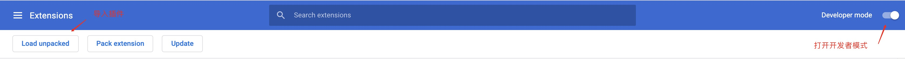
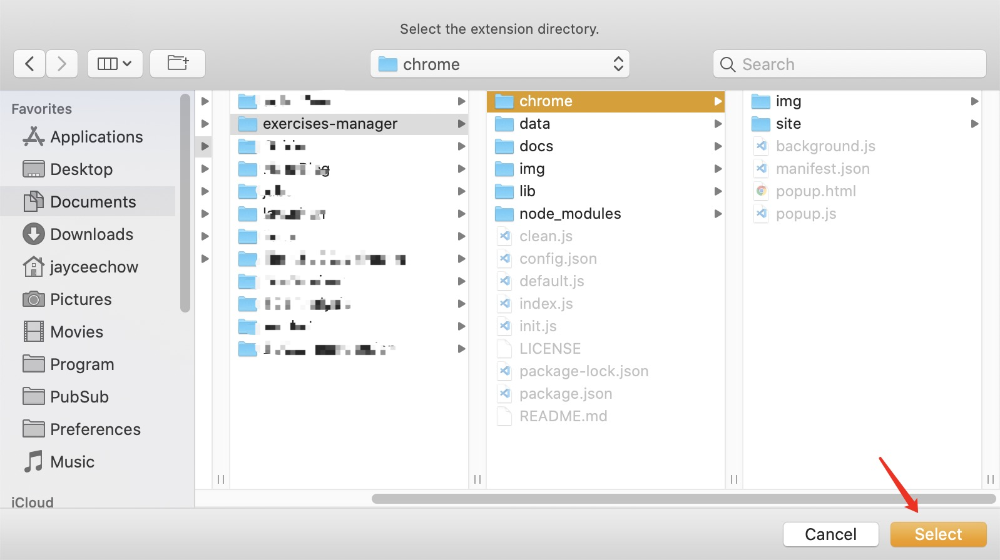

# exercises-manager
## 简介
用于制作在线习题的工具，支持多种模式的翻译。

## 安装说明

1. 下载[Node.js](https://nodejs.org/zh-cn/download/)，注意安装的时候同时安装npm。
2. 克隆仓库到本地:
    ```
    git clone https://github.com/nonlinearthink/exercises-manager --depth=1
    ```
3. 到本地的项目根目录下，运行`npm install`安装项目依赖。

## 使用说明

### Chrome插件使用
这部分主要是用来爬取网页的，目前支持的网站:

|网站|按钮|
|-|-|
|中国大学MOOC|mooc|
|BB教学平台|bb|

#### 具体操作: 
1. 在浏览器中打开链接[chrome://extensions/](chrome://extensions/)。
2. 开启开发者模式。

    
3. 选择刚刚克隆的项目中的一个chrome子文件夹，导入。

    

4. 进入中国大学MOOC或者BB教学平台的网站，点开一个测验试试效果吧。

### 命令行使用

使用网页chrome插件爬取下来的网页只是一个JavaScript对象，然后保存成为一个JSON对象。

我们提供了一个强大的命令行工具来帮助你处理JSON数据，让他们可以在Markdown显示出来。


|命令|功能|
|-|-|
|npm install|初始化，安装依赖|
|npm start|运行主函数|
|npm restart|清理文件和初始化配置|

1. 第一次使用请务必确保你运行了`npm install`。
2. 找到`config.json`配置文件，找到`data-extra-dir`属性，把浏览器的下载路径写进去，例如我是MacOS系统，配置chrome的默认下载路径:

    ```json
    "data": {
    	"switch": true,
    	"template": "json",
    	"storage": "data",
    	"extra": {
    		"file": [],
    		"dir": [
    			"/Users/jayceechow/Downloads"
    		]
    	}
    },
    ```
3. 运行`npm start`，你会发现在目录`data/view`下面出现了一个新的Markdown文件，里面整齐地排列着你的刚才爬下来的题库。

## 自己编写题目
### 创建题目

找到`data/origin`目录，在目录下创建一个txt文件，然后在里面写入：

```
1.世界上最好的语言是什么？
A.C++
B.Java
C.Javascript
D.PHP
D
```

### 程序输出

运行程序，找到`data/view`目录，得到Markdown代码：

```
### 1.世界上最好的语言是什么？
|编号|选项|
|:-|:-|
|A|C++|
|B|Java|
|C|Javascript|
|<font color="red">D|<font color="red">PHP|
```

### 最终显示结果

---
### 1.世界上最好的语言是什么？
|编号|选项|
|:-|:-|
|A|C++|
|B|Java|
|C|Javascript|
|<font color="red">D|<font color="red">PHP|

---

**如果想要了解更多的功能，欢迎访问：**

[exercises-manager官方文档](https://nonlinearthink.github.io/2020/04/12/exercises-manager/)
